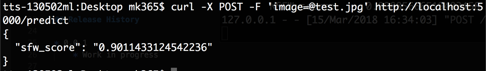

# Flask Open-NSFW
> A **very** hacked together Flask API for the Yahoo Open-NSFW Tensorflow model



## Installation

OS X & Linux:

```sh
cd flask-open-nsfw
python install -r requirements.txt
python main.py
```

## Motivation
Hack together a Flask API to serve the Yahoo Open-NSFW Tensorflow Model:
    1) curl an image
    2) process it with Flask and Tensorflow
    3) return Suitable-For-Work metric (0-10)


## Release History

* 0.0.1
    * Work in progress

## Meta

Matthew Kenney – mk365@duke.edu

[https://github.com/matthewbaykenney/flask-open-nsfw](https://github.com/matthewbaykenney/flask-open-nsfw)

## Contributing

1. Fork it (<https://github.com/matthewbaykenney/flask-open-nsfw/fork>)
2. Create your feature branch (`git checkout -b feature/fooBar`)
3. Commit your changes (`git commit -am 'Add some fooBar'`)
4. Push to the branch (`git push origin feature/fooBar`)
5. Create a new Pull Request